# TinyPaint

TinyPaint is a lightweight painting and image editing application for Unix systems, written in C. (The compiled executable is less than 300 kilobytes)!

I wrote it as an exercise in UI programming, and to better familiarize myself with the Gtk, Gdk, and Glib libraries.

Currently it features a multitude of brushes, filters, undo/redo, and saving/loading images in png format.


## Contents

- [Dependencies](#dependencies)
- [Compiling](#compiling)
- [Features](#features)
	1. [Tools](#tools)
	2. [Filters](#filters)
	3. [Keyboard Shortcuts](#keyboardshortcuts)

<a name="dependencies"></a>

## Dependencies

TinyPaint requires the following packages be installed

- libgtk-3-dev
- libglu1-mesa-dev
- mesa-common-dev

TinyPaint also depends on the [lodepng](https://lodev.org/lodepng/) library, by github user [lvandeve](https://github.com/lvandeve/lodepng). There is a rule in the makefile provided to automatically clone lodepng into the directory that TinyPaint expects. Just run `$ make get_dependencies`.

<a name="compiling"></a>
## Compiling

TinyPaint expects the lodepng library to be in a specific folder. It also uses the Glib Gresource library to compile the icons and ui definitions into linkable source code. Therefore, the order you run the make targets in is important. You **must** run `make get_dependencies` and `make compile_resources`  before you run `make`!

```bash
git clone https://github.com/danielshervheim/TinyPaint.git
cd TinyPaint/core
make get_dependencies
make compile_resources
make
./build/tinypaint
```

TinyPaint also loads shaders at runtime from the `data/shaders` directory, so you must be in the `core`  directory when you run `./build/tinypaint`, otherwise the program won't be able to find and load the shaders.

<a name="features"></a>
## Features

<a name="tools"></a>
### 1. Tools

Pen

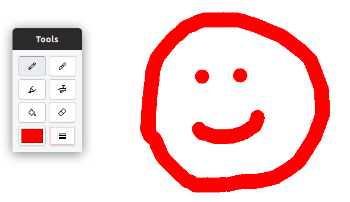

Brush

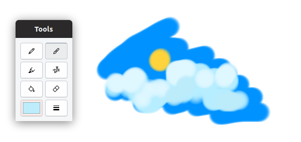

Marker

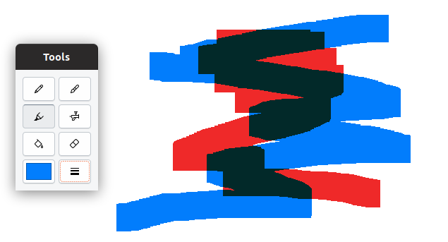

Airbrush

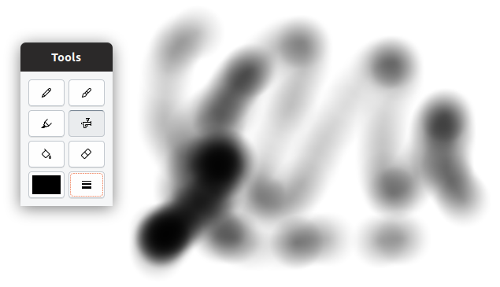

Flood Fill

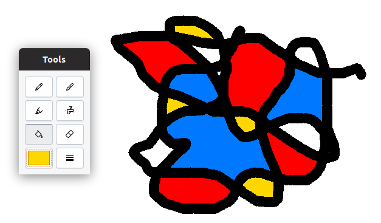

Eraser

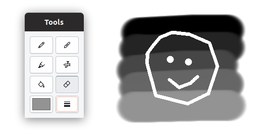

<a name="filters"></a>
### 2. Filters

Saturation

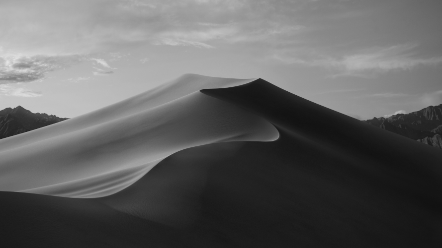

Channels

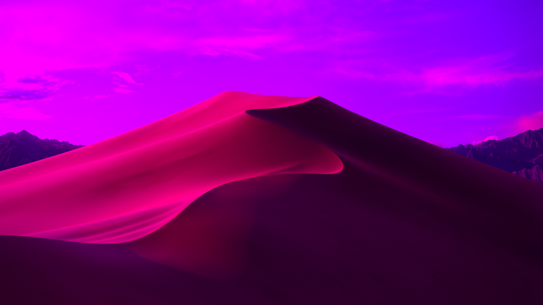

Invert

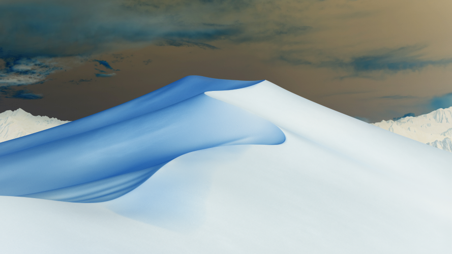

Brightness / Contrast

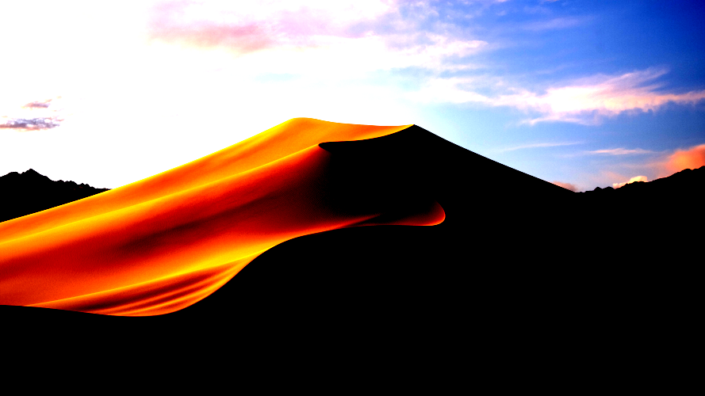

Gaussian Blur


Motion Blur


Sharpen

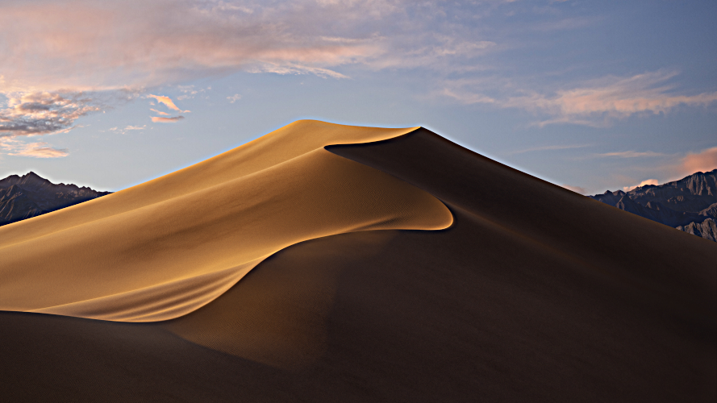

Edge Detection

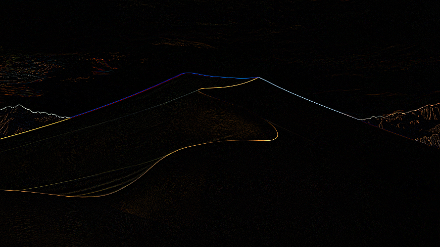

Posterize

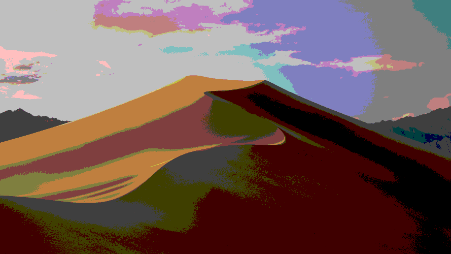

Threshold

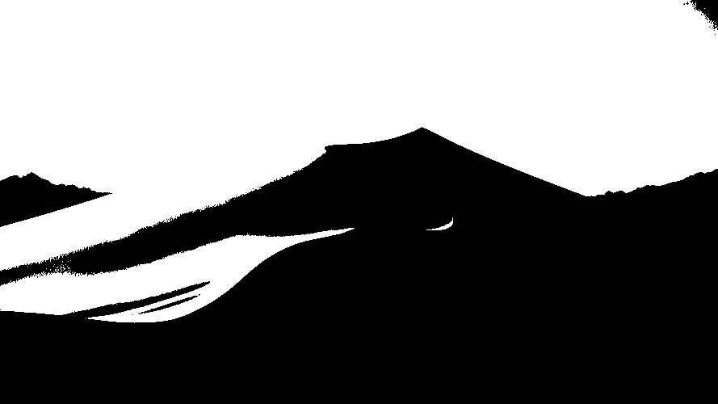

<a name="keyboardshortcuts"></a>
### 3. Keyboard Shortcuts

| Shortcut     | Function   |
| ------------ | ---------- |
| Ctrl+N       | New image  |
| Ctrl+O       | Open image |
| Ctrl+S       | Save image |
| Ctrl+Q       | Quit       |
| Ctrl+Z       | Undo       |
| Ctrl+Shift+Z | Redo       |